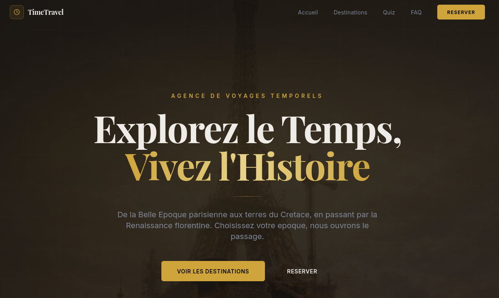

# TimeTravel Agency — Webapp interactive

[](https://nextjs.org/) [](https://react.dev/) [](https://www.typescriptlang.org/) [](https://tailwindcss.com/) [](https://www.framer.com/motion/) [](#)

Webapp moderne et immersive simulant une agence de voyage temporel. Projet réalisé dans le cadre du projet final Ynov.

<p align="center"></p>

## Démo en ligne

App publique : [TimeTravel Agency](https://vm-v54g8l02bi4v7ucayu16ba.vusercontent.net/)

## Membres du groupe

- Robin Thiriet
- Thomas Fauroux
- Tristan Truckle

## Mission du projet

Concevoir une application web immersive permettant de:

- Decouvrir 3 destinations temporelles (Paris 1889, Cretace -65M, Florence 1504)
- Interagir avec un agent conversationnel
- Personnaliser son voyage selon ses preferences
- Preparer une reservation

## Stack technique

- Next.js 16 (App Router)
- React 19 + TypeScript
- Tailwind CSS
- Motion (animations)
- API Mistral (chatbot, optionnel)

## Features implementees

- Page d'accueil immersive avec hero anime + fond video
- Presentation de l'agence et CTA vers les destinations
- Galerie de 3 destinations avec cards interactives
- Page detaillee pour chaque destination
- Chatbot "Chronos" flottant (bas-droite)
- FAQ agence
- Quiz de recommandation personnalisee (4 questions)
- Formulaire de reservation (destination + date + duree + validation)
- Design responsive (mobile / desktop)

## IA utilisees (transparence)

- Generation/iteration UI: v0 + assistant IA
- Agent conversationnel: API Mistral (`mistral-small-latest`) avec fallback local si aucune cle n'est configuree
- Prompt systeme personnalise pour le role "Chronos"

## Installation locale

```bash
git clone https://github.com/RobinThiriet/TimeTravelAgency.git
cd TimeTravelAgency
npm install
npm run dev
```

Application locale : http://localhost:3000

## Configuration (variables d'environnement)

Créer un fichier `.env.local` à la racine pour activer le chatbot Mistral :

```env
MISTRAL_API_KEY=your_key_here
MISTRAL_MODEL=mistral-small-latest
```

Sans ces variables, le chatbot fonctionne en mode mock local.

## Assets et credits

- Images destinations: `public/images/`
- Videos destinations: `public/videos/paris.mp4`, `public/videos/cretace.mp4`, `public/videos/florence.mp4`
- Librairies open source: Next.js, React, Tailwind CSS, Motion, Lucide, shadcn/ui
- API IA: Mistral AI

## Structure du projet

Voir l'organisation principale :

[app/](app/)
[components/](components/)
[lib/](lib/)
[public/](public/)

Les composants UI se trouvent dans le dossier `components/` et les helpers dans `lib/`.

## Déploiement

Plateforme recommandée : Vercel

1. Importer le repository GitHub
2. Ajouter les variables d'environnement (optionnel)
3. Lancer le deploy
4. Tester l'URL publique sur desktop et mobile

## Livrables (Moodle)

- URL publique de la webapp (fonctionnelle)
- Repository GitHub
- README technique (ce document)
- Noms et prenoms des membres sur les livrables

## Rollback

Tag de secours disponible : `initial-stable`

```bash
git checkout initial-stable
```

## Licence

Projet pédagogique — Ynov Campus.

